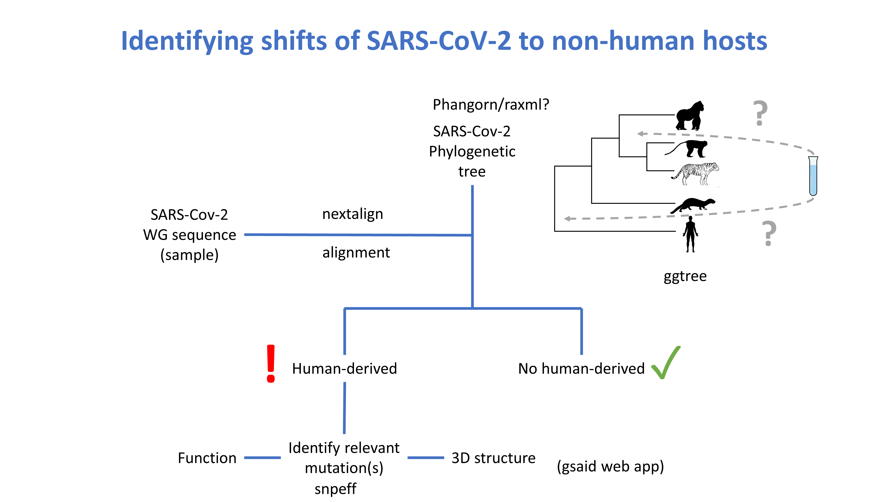

# Project Name: Nonhuman Host Susceptibility
---
**Team Leaders**: Thomas Keller, Swamy Rakesh Adapa 

**Team Members**:  Atmaja	Koorapati, Celine	Atkinson, William	Cromwell, Vijay	Chauhan, Kyle	Koller, Soa Fy	Andriamandimby, Raúl	A. González-Pech, Morgan Young

**GVN/USF mentors**:

## Objectives

The primary objective is to build an interactive application/ web app that can identify putative host-shifts where recent Covid sequences have evolved and jumped into a non-human host.
We provide a variety of non-human sequences, and allow the user to upload a sequence of their choice. Then the new sequence is placed into the alignment and a phylogeny is built.

Host shifts will be identified as the novel sequence being placed in clades of other sequences of host-shift sequences, such as that of the human-mink shift in fall 2020.

## Pipeline & Outline

## Methods and Implementation

We implemented the dashboard using an R package called flexdashboard, which allowed us to focus more of us efforts on the other individual components. Namely, the input, alignment, phylogenetic tree and visualization. The alignment was a custom Matlab script provided by one of the team members, Morgan Young. The tree estimation was done using the R package phangorn. Visualization of the tree was done using phylocanvas.

We provided a set of whole-genome Covid sequences that covered a variety of known human to non-human host shifts. These include the following species (ferret, mink, tiger,lion, more).

## Results

What did we find?

## Installation & Running

The main program is an Rshiny app. Therefore, you will need both a base R installation, as well as Rstudio. Once you have those downloaded, you will need to install the following packages:

phangorn\n
ape\n
DECIPHER\n
shiny\n
flexdashboard\n
phylocanvas\n

If you want to use some of the auxillary programs, the following packages are also required
fs\n
readr\n
purrr\n
dplyr\n
from bioconductor\n
Biostrings\n

